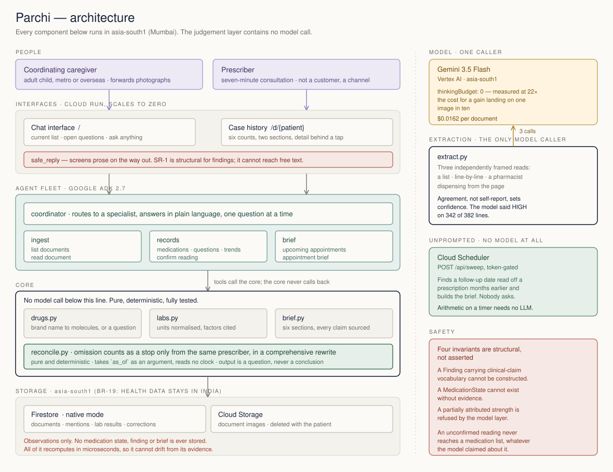

# Parchi

**An agent that reads a family's medical paperwork and produces a medication list with provenance, plus the questions worth asking at the next appointment.**

It does not diagnose, advise, or assert drug interactions. Ever.

| | |
|---|---|
| **Live** | https://parchi-638690742795.asia-south1.run.app |
| **Prescriber view** | https://parchi-638690742795.asia-south1.run.app/d/p-fixture-1 |
| **Demo video** | *(to be added before submission)* |
| **Hackathon** | [All Things Agentic](https://allthingsagentichackathon.devpost.com/) · category **Collaborative Partner** |
| **Region** | `asia-south1` (Mumbai) — everything, including document images |
| **Tests** | 355, all offline |

---

## The problem

An adult child coordinating care for an ageing parent holds a mental model that is permanently out of date. The parent sees four prescribers who have never spoken to each other. Lab work happens wherever is nearest. The record is a plastic folder, a WhatsApp thread, and handwritten slips nobody can read.

Three things go wrong, over and over:

- **Nobody knows the current medication list.** Prescribers write brand names, so one molecule arrives under several names from several doctors. Fixed-dose combinations hide molecules inside them. Drugs are stopped verbally and never struck out.
- **Trends are invisible.** A value drifting over years, measured at different labs in different units, looks borderline on every single report and alarming only in sequence.
- **Every appointment starts from zero.** Hours of preparation, seven minutes of consultation, instructions forgotten before the pharmacy.

India's ABDM has crossed 100 crore linked health records, but it addresses **transport**, not **synthesis** — records stay with the provider who made them. And its consent model is provider-to-provider: the caregiver is not an actor in that architecture at all. Every existing product serves the patient or the provider. Nobody builds for the coordinator.

---

## What it does

**Bulk, unordered upload.** Forward between one and forty photographs. Nothing is sorted, labelled or renamed first, because any flow requiring that will not be used. Each document is classified, read, and placed on a timeline by **the date printed on it** — never the upload date. Thirteen documents uploaded in scrambled order produce a correctly ordered timeline; anything with no legible date is listed apart rather than quietly slotted in under today.

**A medication list that survives four prescribers.** Brand names resolve to molecules, including inside fixed-dose combinations. When one molecule reaches the patient through two products — atorvastatin arriving both as Ecosprin AV and as Storvas, written by two doctors five weeks apart — that becomes a question naming both products.

**A confirmation loop for what it could not read.** An uncertain reading is shown beside the region of the image it came from, with the caregiver's correction retained and applied to later documents from the same prescriber without asking again. Until confirmed, it does not reach the medication list at all.

**Lab values on one axis.** Units normalised per analyte, every conversion factor cited in the source. A Metropolis report printing HbA1c as `64 mmol/mol` lands on the same axis as an SRL report printing `7.1 %`, each point keeping the reference range printed on *its own* report.

**An appointment brief nobody asked for.** A follow-up date read off a prescription in June triggers a one-page brief two days before the August appointment, with no user action of any kind.

**A case history the caregiver hands over.** `/d/{patient}` is built for seven minutes: six counts, two visible sections — what changed since your last visit, what the family is asking — and the medication list, trends and tests-on-file behind a tap.

---

## Architecture



Three things in that diagram are the design, not decoration:

**The judgement layer contains no model call.** `reconcile.py` is pure deterministic Python. It decides whether a drug was stopped, whether two products overlap, whether a trend exists — and it does so identically every time, with tests, and with an audit trail. The agents decide *when* to look and carry the conversation; the tools compute the answer exactly.

**Nothing derived is ever stored.** Firestore holds documents, medication mentions, lab results and corrections — the evidence. It never holds a medication state, a finding or a brief. Those recompute in microseconds on every request, which makes drift structurally impossible rather than merely unlikely.

**One component talks to the model.** `extract.py` reads each document three times with materially different prompts and derives confidence from whether the reads agree. Everything downstream is arithmetic.

---

## Required technologies

Verified against the official rules, and each one load-bearing rather than bolted on.

| Requirement | How it is met |
|---|---|
| **Gemini 3.5 or newer** | `gemini-3.5-flash` via Vertex AI in `asia-south1`. Verified present on the account by probing model IDs directly — the Pro tier's newest listed version is 3.1, which does not satisfy "3.5 or newer" on a literal reading, so the Flash tier is used throughout. |
| **A Google agent framework** | **Google ADK 2.7** — three registered agents (`ingest`, `records`, `brief`) behind a routing coordinator, each with its own instruction and tool set. The **Google GenAI SDK** is used for the extraction harness. Both are named requirements. |
| **A Google Cloud infrastructure service** | **Cloud Run** (scale to zero), **Firestore** native mode, **Cloud Storage**, **Cloud Scheduler**. All in `asia-south1`. |

§10 of the PRD asked for three agents rather than a monolith, and there are three — but `reconcile()` and the brief contain no model call, so wrapping them in `LlmAgent`s would have been theatre. The PRD says plainly: do not fake an integration.

---

## Try it

Python 3.11+. The first three commands need no cloud account.

```bash
git clone https://github.com/shivama205/parchi.git && cd parchi
python3 -m venv .venv
./.venv/bin/python -m pip install -e '.[dev]'
```

Run the test suite — 355 tests, about half a second, no network:

```bash
./.venv/bin/python -m pytest -q
```

See the reconciliation engine work on the constructed scenario — nine documents, three prescribers, fourteen months:

```bash
./.venv/bin/python -m parchi.demo
```

See the unprompted brief. **This takes no arguments, which is the point** — a scheduled sweep finds a follow-up written on a prescription in June and builds the brief for an appointment in August:

```bash
./.venv/bin/python -m parchi.brief
```

### With a Google Cloud project

Fetch the handwriting corpus and generate the printed documents:

```bash
./.venv/bin/python -m pip install -e '.[fixtures]'
./.venv/bin/python fetch_fixtures.py
./.venv/bin/python make_documents.py
```

Read one real handwritten Indian prescription. About two cents:

```bash
GOOGLE_CLOUD_PROJECT=your-project ./.venv/bin/python -m parchi.extract \
  fixtures/external/mirage-100/images/rx-004.jpg
```

Run the whole service locally, in-memory, with a pinned clock so it is reproducible:

```bash
./run_local.sh
```

---

## Deploy it

```bash
gcloud services enable run.googleapis.com firestore.googleapis.com \
  cloudscheduler.googleapis.com aiplatform.googleapis.com \
  storage.googleapis.com --project=YOUR_PROJECT
```

Firestore and the image bucket, both in India:

```bash
gcloud firestore databases create --location=asia-south1 --project=YOUR_PROJECT
```

```bash
gcloud storage buckets create gs://YOUR_PROJECT-parchi-docs \
  --project=YOUR_PROJECT --location=asia-south1 \
  --uniform-bucket-level-access --public-access-prevention
```

Then edit `PROJECT` in `deploy.sh` and run it:

```bash
./deploy.sh
```

Finally the scheduled sweep, which is what makes the brief unprompted. There is
no model call behind this endpoint — finding a date in a window and assembling a
cited brief is arithmetic, and paying a model to do arithmetic on a timer is how
a per-patient budget disappears:

```bash
gcloud scheduler jobs create http parchi-sweep --project=YOUR_PROJECT \
  --location=asia-south1 --schedule="0 7 * * *" --time-zone="Asia/Kolkata" \
  --uri="$(cat .sweep-token.local >/dev/null && echo YOUR_SERVICE_URL)/api/sweep" \
  --http-method=POST --headers="x-parchi-token=$(cat .sweep-token.local)" \
  --attempt-deadline=300s
```

Confirm it fired rather than assuming it did — a job can exist and never have
run:

```bash
gcloud logging read 'resource.labels.service_name="parchi" AND httpRequest.requestUrl=~"sweep"' --project=YOUR_PROJECT --limit=3 --freshness=20m --format="value(timestamp,httpRequest.status,httpRequest.userAgent)"
```

A `200` with userAgent `Google-Cloud-Scheduler` is the proof. The token lives in
a gitignored file; Secret Manager is the production answer, and putting it in a
job header means it is visible in the job's configuration.

`deploy.sh` derives the bucket name from `PROJECT`, so if you named yours
differently, set `BUCKET` too.

Three deployment details that are not obvious and cost real time to discover. All
three are handled in `deploy.sh`; they are written down because each one fails in
a way that does not look like a failure.

- **`gcloud run` needs `grpcio`**, which the Homebrew cask's Python does not have. `deploy.sh` points `CLOUDSDK_PYTHON` at a virtualenv that does and sets `CLOUDSDK_PYTHON_SITEPACKAGES=1`; without both, every `gcloud run` command fails with `No module named 'grpc'`.
- **Cloud Run throttles CPU outside a request** by default, which silently freezes the background ingestion started by `/api/upload`. Without `--no-cpu-throttling`, an upload returns `200` and nothing is ever read. Cloud Tasks is the production answer.
- **`PARCHI_BUCKET` must be set**, or `make_blobs()` falls back to the container filesystem. That is the worst of the three, because it does not look broken: the upload returns `200`, the image writes to a disk that is ephemeral and per-instance, and it disappears when Cloud Run scales to zero or routes the next request elsewhere.

A bare `/healthz` is answered upstream of the container on Cloud Run — the 404 arrives with no `Google Frontend` header — so health lives at `/api/health`.

---

## The central judgement

> Absence of a drug from a prescription usually means nothing, and occasionally means everything.

A cardiologist's script omitting the diabetologist's metformin tells us **nothing**; he was never managing it. The *same* cardiologist, having previously listed six drugs, writing a fresh script listing five, has *probably* stopped one.

So omission counts as evidence of stopping only when it comes from the **same prescriber**, and only when that prescriber's new script re-lists at least **60%** of the molecules they had previously written — a comprehensive rewrite rather than an add-on slip. Even then the output is a question, never a conclusion.

`COMPREHENSIVE_REWRITE_THRESHOLD` and `STALE_AFTER_DAYS` are judgement calls, not derived constants. Too low a threshold and every add-on slip triggers a false "did the doctor stop this?", which teaches the caregiver to ignore us. Too high and real stops go unnoticed.

Because `reconcile()` is pure and takes `as_of` as an argument, "what changed since your last visit" is just the same function run over the documents that existed then. No second code path, no snapshot to drift.

---

## What we learned

The four findings below each changed the build. All were measured, not assumed.

### The model's confidence is not a usable gate

PRD §9.3 asked the model for a per-field confidence, and §5.2 gated on it. Measured across 85 handwritten Indian prescriptions, that signal does not exist:

| | |
|---|---|
| Lines returned HIGH | **342 of 382** — including 88 matching no annotated drug |
| Lines returned LOW | **11** — and not one of those was a correct reading |

It essentially never expresses doubt. So Parchi stopped asking. Confidence is **derived from agreement between independently framed reads** — unanimous is HIGH, a majority MEDIUM, a lone dissenting read LOW and therefore gated. Independence comes from the *prompt*, not from temperature: three reads at temperature zero sharing one prompt would be one read repeated.

The brand table is the second net. Three reads agreeing on garbage is still garbage, and an unresolvable reading never becomes medication state whatever its agreement.

### Three cheap reads beat thinking

| Configuration | Recall | Cost/image | Wall, 10 images | Lines flagged |
|---|---|---|---|---|
| 1 cheap read | 74.3% | $0.0033 | — | none possible |
| 2 reads + thinking escalation | 80.0% | $0.0680 | 219s | 1 of 35 |
| Always thinking | 82.9% | $0.0729 | 284s | unusable |
| **3 cheap reads (shipped)** | **82.9%** | **$0.0162** | **20s** | **15 of 42** |

Thinking spend is **bimodal**: median 1,840 tokens, spiking to 62,910. One escalation in ten images cost **$0.58 on its own** — an entire patient's monthly budget. Nonzero `thinkingBudget` values are silently ignored (256 and 1024 both produced ~62,911 tokens on the same image), so the spend cannot be capped and it behaves as a boolean.

A third framing — asking the model to act as a pharmacist dispensing from the page — matched always-thinking's recall at a quarter of the cost and a fourteenth of the wall time, and calibrates far better.

### Real paper found five bugs the fixtures could not

Reading a *single* genuine prescription, before writing any extraction code, surfaced three parser defects. Two more came from the first live runs.

| Written as | Was parsed as | Consequence |
|---|---|---|
| `DOLO TAB 650MG` | unresolvable | Form word mid-string — 0 of 344 lines resolved |
| `Volix (0.3mg)` | `0` and `3` | Decimal point stripped as punctuation — a tenfold strength error |
| `Telma 40 1 OD` | `40mg` and `1mg` | Dose quantity counted as a strength, discarding the real 40 mg |
| `T Allegra 120mg` | unresolvable | `T` for tablet unhandled — invisible to the corpus metric |
| `Cont. Tab Glimy` | a second drug | "Continue" read as part of the brand, inventing a duplicate |

The fourth is the instructive one. It never appeared in the accuracy numbers, because the ground-truth annotations write `ALLEGRA TAB 120MG` — the bug lived only in what the model *emits*. Validating against labels alone would have shipped it.

### A claim is not a name

SR-1 forbids clinical-claim vocabulary in anything a caregiver sees, and `diagnos` is on the list so "diagnosis" and "diagnostic" cannot slip through. The first time a real laboratory name reached a finding, reconciliation crashed: a major Indian chain is called **SRL Diagnostics**, and most Indian labs are named that way. Any patient using one would have brought the service down.

The fix is not to mangle the name. SR-1 exists to stop Parchi *asserting* something clinical, not to stop it saying where a test was run. Quoted text is now two kinds:

- **A proper noun we matched** — laboratory, prescriber, brand in the table — is declared in `quoted_names`, masked before the scan, and shown intact.
- **A reading that resolved to nothing** is arbitrary model output about an unreadable scrawl and can say anything, so forbidden vocabulary in it is redacted. Quotation marks are not much defence when someone is skimming a phone at a bus stop.

Masking is not a loophole: the words around a name are still scanned, so a finding saying "you should stop taking it" fails whatever names it carries. Both directions are tested.

---

## Safety

Nine invariants, each with a passing test. **Four are structural** — not assertions that get checked, but conditions the objects cannot violate.

| | Invariant | How |
|---|---|---|
| SR-1 | No finding contains clinical-claim vocabulary | **Structural** — `Finding.__post_init__` |
| SR-2 | Every finding's question ends in "?" | **Structural** |
| SR-3 | An unconfirmed low reading never leaves `UNCERTAIN` | `MedicationMention.is_usable` |
| SR-4 | Every medication state cites its evidence | **Structural** |
| SR-5 | An unresolvable brand never becomes state | `drugs.resolve` returns `()` |
| SR-6 | No strength where parsed count ≠ molecule count | **Structural** |
| SR-7 | `reconcile()` is pure and deterministic | test |
| SR-8 | No drug interaction asserted in code or prompts | source scan |
| SR-9 | No real patient data; fixtures declared constructed | source scan |

A `Finding` carrying clinical-claim vocabulary **cannot be constructed**. A `MedicationState` cannot exist without evidence. A `MedicationMention` refuses to hold a partially attributed strength. Failing loud is deliberate.

**Where the guarantee stops.** SR-1 is structural for findings and cannot reach an agent's free prose. A live run proved why: given the finding *"Was torsemide discontinued, or was it left off the prescription of 20 Jun 2026?"*, the agent reported *"Was Torsemide intended to be stopped **permanently**?"* — and "permanently" is nowhere in the evidence. `safe_reply` therefore screens everything leaving the process and withholds a reply carrying forbidden vocabulary, sending the cited findings instead. That is a mitigation, not a proof. No invariant can constrain a language model from the inside, and pretending otherwise would be the kind of overclaim this product exists to avoid.

---

## Two deliberate departures from the spec

**Strength attribution is narrower than §6.4.** §6.4 requires the parsed strength count to equal the molecule count. That is necessary but not sufficient: `Glycomet GP 1/500` is glimepiride 1 mg + metformin 500 mg, while the table lists metformin first. Two numbers against two molecules passes the count test and attributes both backwards. Strengths are therefore attributed only for single-molecule products; combinations stay silent and the written strength survives verbatim in `brand_text`. `JANUMET 50/1000MG TAB` in the real corpus is exactly this case.

**Suffix-dropping is guarded structurally.** §7 named three transcription confusions by hand. A reading that loses its suffix resolves cleanly to the base product and silently drops a molecule — `Telma H` read as `Telma` deletes a diuretic. Any brand whose name is a strict prefix of another brand's is therefore treated as confusable with its longer siblings, **derived from the table's own shape**, so adding a combination product automatically makes its base demotable and the guard cannot go stale. The demotion is one step and conditional on the family differing molecularly: Telma and Telmikind are both plain telmisartan, so penalising that pair would make every printed telmisartan prescription unusable for no safety gain.

---

## What was deliberately not built

**Adherence.** We only ever see paper. A prescription records what was *prescribed*, never what was *taken*, and a gap between scripts could be a switched pharmacy, a sample pack from the clinic, a hospital admission, or a strip bought over the counter without one. Inferring skipped doses from documents would be the confidently-wrong claim this codebase is arranged to prevent.

The honest version already exists: `STALE_AFTER_DAYS` surfaces *"metformin was last written 200 days ago with no end date — is it still being taken?"* That is an observation about paper, paired with a question. A caregiver-reported log — "he stopped the Zoryl last week", cited to the person who said it — is the right next step, and it needs a conversation layer rather than a new inference engine.

Also permanently out of scope: diagnosis, triage, symptom checking, dose recommendations, drug interaction assertions, medicine ordering, lab booking, teleconsultation, health scores, and diagnostic lab partnerships. Each of the last three would create a revenue conflict with the trust position; the product's value rests on not being another party with an interest.

---

## Limits, stated rather than hidden

**Agreement detects disagreement, not shared omission.** A drug that every read misses produces no line at all, so it cannot be flagged — it is simply absent, and at 82.9% recall roughly one drug in six is. The confirmation loop surfaces what was read badly; it can never surface what was never seen. **A caregiver must not be told the list is complete.**

**The brand table is demo-grade.** 73 brands, assembled by hand, resolving 70 of 344 annotated drug lines in the corpus (20.3%). Compositions change when manufacturers reformulate, and a wrong mapping produces a confidently incorrect medication list — the worst failure this product has. Before real use it must be replaced with a table derived from an authoritative source (NPPA ceiling-price notifications, CDSCO listings) with a human review step; the machine-readability of those sources has not been verified. Nineteen brands were added from the corpus and several candidates were **left out** because verification came back thin or contradictory: one search returned *Volini*, a topical pain spray, for *Volix*.

**A cold upload is less reliable than the seeded scenario.** Findings like the duplicate molecule and the dropped drug need every relevant reading to land cleanly. They appear from a cold upload, but not on every run — one low-agreement reading is enough to push a comprehensive rewrite below the threshold, at which point the system correctly declines to suggest a stop.

**Nothing here has been reviewed by a clinician or a lawyer.** Both are required before any real patient data is processed. The non-diagnostic design is *intended* to keep the product outside the definition of Software as a Medical Device, but that needs verifying against the Medical Devices Rules 2017 and current CDSCO guidance, and the DPDP position needs verifying against the current rules.

---

## Data sources

**Every fixture in this repository is constructed. No real patient data appears anywhere** — not in the repo, not in the demo, not in the deployed service.

**The scenario** (`parchi/fixtures.py`) was written by hand for the test suite: one patient, 68, diabetes and hypertension, three prescribers, fourteen months. "Ramesh", "Dr Rao", "Dr Iyer", "Dr Menon", the clinics and the laboratories are invented. It contains, deliberately, a fixed-dose combination hiding a duplicate molecule, a comprehensive rewrite that drops a drug, an add-on slip that drops nothing, a completed antibiotic course, and a low-confidence handwritten entry.

**Printed documents** (`make_documents.py`) are generated from that same scenario, so the images and the tests cannot drift apart. Thirteen prescriptions and lab reports on invented clinic letterheads, each stamped *CONSTRUCTED DOCUMENT*.

**Handwriting** comes from a 100-record subset of the MIRAGE corpus, released by its authors on HuggingFace: [`chaithanyakota/100-handwritten-medical-records`](https://huggingface.co/datasets/chaithanyakota/100-handwritten-medical-records), licence **CC BY-ND 4.0**. Attribution: *MIRAGE: Multimodal Identification and Recognition of Annotations in Indian General Prescriptions* ([arXiv:2410.09729](https://arxiv.org/abs/2410.09729)); the full 743,118-image corpus is proprietary to Medyug Technology Pvt. Ltd. and is not public. The dataset card does not state whether these prescriptions are real or simulated, and this repository does not assert either beyond what each source says.

The NoDerivatives term shapes two design decisions. **Images are fetched, never redistributed** — `fetch_fixtures.py` makes the corpus reproducible without the repository carrying it, `fixtures/external/` is gitignored, and image bytes are written with no re-encoding. And **the confirmation loop draws a highlight box over the full image rather than showing a crop**, because §9.3 requires the caregiver to see what the model was looking at and an overlay achieves that without producing a modified copy.

**Lab conversion factors** are cited at each entry in `parchi/labs.py`: the [UK Kidney Association's conversion appendix](https://www.ukkidney.org/sites/renal.org/files/Appen-I.pdf) for cholesterol, creatinine and glucose; the [NGSP IFCC master equation](https://ngsp.org/ifcc.asp) for HbA1c (`NGSP% = 0.09148 × IFCC + 2.152`, affine rather than a scale factor — multiplying by a factor would be badly wrong); and molar-mass derivation where the appendix rounds or does not list the analyte. A test fails if any factor is added without provenance.

---

## Cost

Measured on the account, not estimated.

| | |
|---|---|
| Per document, three reads with bounding boxes | **$0.0162** |
| Steady state, ~4 new documents and a brief per month | **≈$0.08/patient/month** (about ₹7 against the ₹25 target) |
| Onboarding, 30 documents, one-off | **≈$0.49** |
| Total spent building this | **under $5** |

The judgement layer costs nothing to run, because it is arithmetic. Per-token prices came from pricing aggregators, because Google's own pricing page would not render — re-verify before quoting them.

---

## Repository map

| | |
|---|---|
| `parchi/models.py` | Data model. Observations immutable, state derived. SR-1/2/4/6 structural. |
| `parchi/drugs.py` | Brand → molecules. Exact-match only; an unlisted variant becomes a question. |
| `parchi/labs.py` | Analyte canonicalisation and unit conversion, every factor cited. |
| `parchi/reconcile.py` | **The product.** Pure, deterministic, no model call. |
| `parchi/extract.py` | The only model caller. Three framings, agreement-based confidence. |
| `parchi/brief.py` | Six sections, every claim sourced. The J3 sweep. |
| `parchi/agent.py` | ADK fleet: coordinator plus ingest, records, brief. |
| `parchi/store.py` | Firestore and in-memory. Evidence only, never derived state. |
| `parchi/blobs.py` | Cloud Storage and local. Document images. |
| `parchi/server.py` | HTTP surface, upload pipeline, `safe_reply`. |
| `tests/` | 355 tests, all offline behind faked transports. |

`CLAUDE.md` holds the working rules for anyone — human or agent — changing this code.
